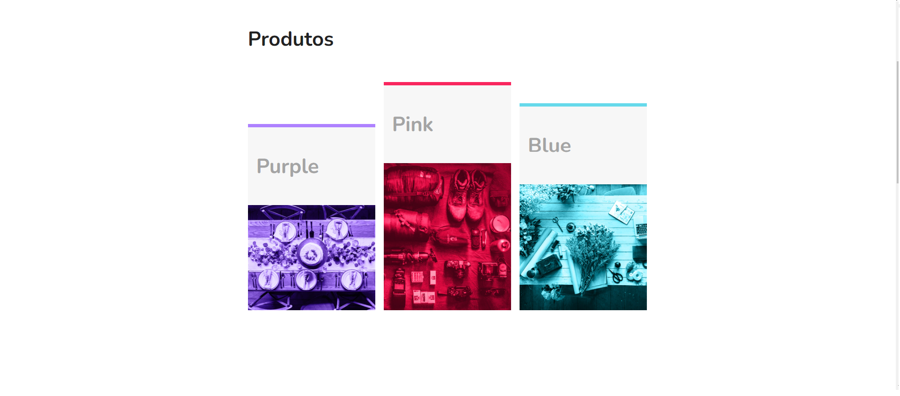
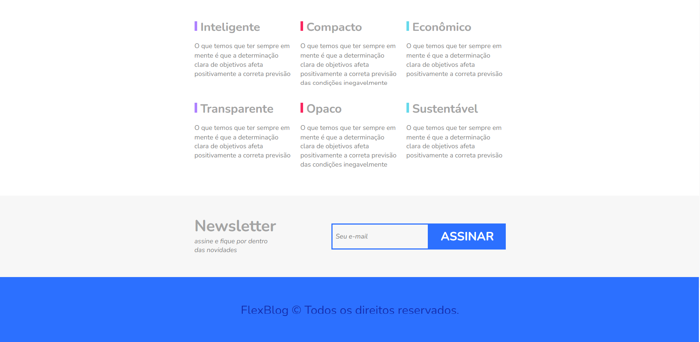

# FlexBlog
FlexBlog é uma página construida somente em html e css utilizando Flexbox para construção de seu layout e Flex-wrap para deixar o mais responsivo possivel ultizando pouco do @media screen, a ideia é utilizar somente flexbox para trabalhar meus conhecimentos de estilização.

<h1>Templates</h1>

